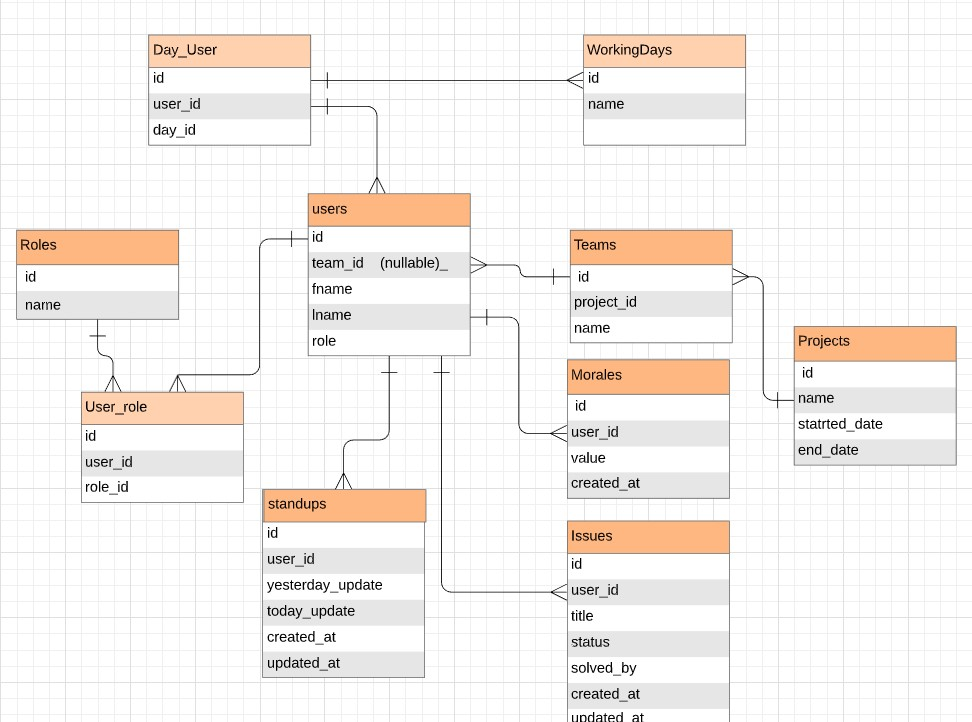

<p align="center"></p>


# About 

This application  is an online tool useful for Agile teams using the Scrum framework, but it’s especially helpful for: remote, distributed, software, marketing,  HR, legal and support teams to stay in sync.

When working with a distributed team in an Agile environment, It could be hard to maintain a record of who's is doing what. In the daily standup each team member give updates to the team about his tickets to distribute knowledge among the team by answering three questions.

1. What I did yesterday? 
2. What I will  do today? 
3. Is there any issues I am currently facing and needs help?

Moreover, Team morale is a Agile metric to monitor the team's morale,  each member  select a value between -1 , 0 and 1 to represent his attitude. If a team select the -1 option he should explain the reason and other members offers to support him. 

## **Prerequisites**

The following  dependences  must be installed on your local development environment to run the application.

1.  Composer 
2.  PHP 7.3 
3.  Node.js 

## **Installation**

The following step by step series  will  help you to install the dependencies and  get a development

 environment running. 

1. **Clone the repository to your local machine.**

   ```php
   git clone  https://github.com/advanced-web/awp-1-RomanyU1662160.git
   ```

2. **In your command run the following commands**  *make sure you are in the reposiotry direcotry*

```php+HTML
composer install
```

```
php artisan key:generate
```

```javascript
npm install
```


3. **Rename the  .env_example  file in your root folder to .env  and add your DB name and credentials**

   ```php+HTML
   DB_DATABASE= your database name
   DB_USERNAME= DB  username 
   DB_PASSWORD= DB  password 
   ```

   

4. **You <u>Must</u> Add  the Algolia API credentials  to get the  filter searching working**

   ```php
   ALGOLIA_APP_ID=  Your Algolia app id 
   ALGOLIA_SECRET=  Your Algolia  admin secret key
   ```

   

   ```php
   MIX_ALGOLIA_APP_ID= Your Algolia app id 
   MIX_ALGOLIA_SEARCH= Your Algolia  search only secret key
   ```

   

5. **Seeding the DB**

```php
php artisan migrate --seed
```

## System Functionality 

## 1- CRUD functions 

- **C**reate new Stand up *(all users)*
- **C**reate new Project *(admins only)*
- **R**ead Project, Team and User details *(all users)*
- **U**pdate Project details *(admins Only)*
- **U**pdate Team details *(admins Only)*
- **U**pdate working days( all users  )
- **D**elete teams from a project (admins only)
- **D**elete members from a team (admins only)

## 2- Authentication

- Login/Register System
- Guests are authenticated to access the home page only.

## 3- Authorization

- Only Admins are authorized to access the Admin dashboard.
- Logged user authorized to update his own details only, not other users’ details.

## 4 -Search

- **Filter Searching :** Search for anything in the home page using Algolia.
- **Specific Searching** : Search for specific Projects ,Teams or User.

## 5- Accessibility

-  HTML attributes 

```html
<table class="table table-hover">
        <thead>
         <tr>
              <td>  
               <strong>  Full Name: </strong>
             </td>
           <td>  {{ $member->getFullName()}} </td>
          </tr>
       </thead>
        <tr>
              <td>  
               <strong>  Email: </strong>
             </td>
           <td>   {{ $member->email}} </td>
          
        </tr>
```

- Validation 

  All forms in the application are validated and a validation errors are  displayed in a red color.

- Responsive working on mobiles 

  The application has been tested on mobiles using the Chrome dev tools. Using the Bootstrap library makes the application  responsive  on various screen sizes.

## 6- Database Design 

<p align="center"></p>